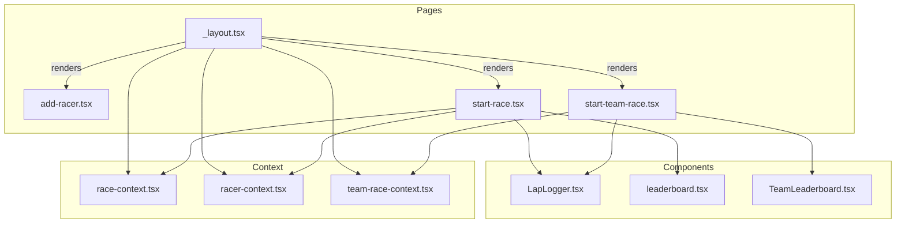

```mermaid
graph TD
%% Pages
subgraph Pages
Layout[_layout.tsx]
AddRacer[add-racer.tsx]
StartRace[start-race.tsx]
StartTeamRace[start-team-race.tsx]
end

%% Components
subgraph Components
LapLogger[LapLogger.tsx]
Leaderboard[leaderboard.tsx]
TeamLeaderboard[TeamLeaderboard.tsx]
end

%% Context Providers
subgraph Context
RaceProvider[race-context.tsx]
RacerProvider[racer-context.tsx]
TeamRaceProvider[team-race-context.tsx]
end

%% Relationships
Layout --> RaceProvider
Layout --> RacerProvider
Layout --> TeamRaceProvider
Layout -->|renders| AddRacer
Layout -->|renders| StartRace
Layout -->|renders| StartTeamRace

StartRace --> LapLogger
StartRace --> Leaderboard
StartRace --> RaceProvider
StartRace --> RacerProvider

StartTeamRace --> LapLogger
StartTeamRace --> TeamLeaderboard
StartTeamRace --> TeamRaceProvider
```

AddRacer --> RacerProvider
